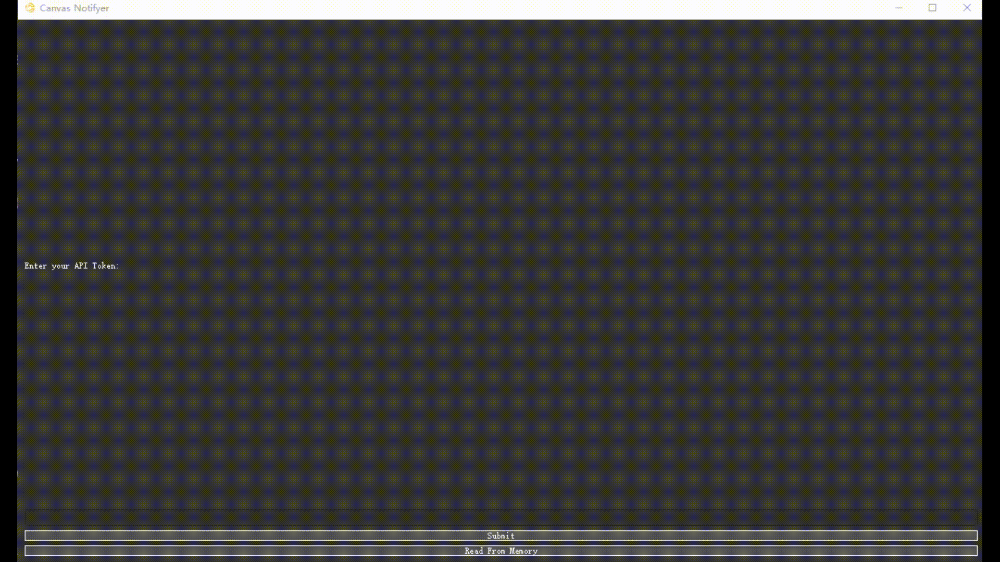

# CanvasNotifyer
A GUI program that retrieve and store information from Canvas. Targeted users are UBC students.

## Features
- <b>Offline Accessibility</b>
  - All the information is stored in a database, allows the users to access without an internet connection (In case the Canvas server is down or `ubcINsecure` is down)

## How to use
- Please notice that Python 3.10 is not supported, use 3.9 or below
- First, create a `token` from the canvas and input it into the program, it would remember it from now on so you don't need to input it again
- Please note that it may take some time for the first time, but it would read directly from the database once it is established

## Disclaimer
This project is not affiliated with Canvas or Instructure. It is an independent tool created to enhance the Canvas experience for its users.

## Contributions:
Contributions and improvements to this project are welcome. Feel free to submit pull requests, report issues, or suggest new features to enhance Canvas Notifyer further.

## Future Plans
- Adding graph for assignment points
- Adding `PraireLearn` and `WebWork`
- Notification function for having assignments within 24hrs